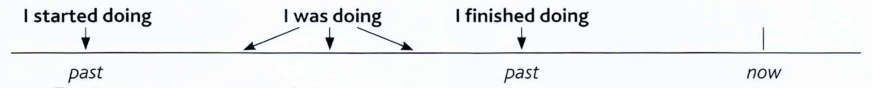

# 过去进行时（I was doing）
> 表示过去在某一时间段或某一段时间内正在发生或进行的动作或状态。

下面是一个例句：

```
Yesterday  Karen  and jim played tennis. 
They started at 10 o'clock and finished at 11.30.
So, at 10.30 they were playing tennis.
```

例句里，在 10：30 表示两人在过去一个时刻正在做的行为。所以，使用过去进行时。

过去进行时和一般过去时有些差别。前者主要指在过去某一特定时间段内正在做的事情；后者用来强调过去做了某件事。下面这张图更详细地说明过去进行时和一般过去时：



过去进行时用于以下场景：

- 过去时间段内已经开始，还未结束的行为
> This time last year I was living in Brazil.

- 和一般过去时搭配使用，强调当另一件事进行时，某件事发生了
> He phoned me while I was having dinner with my family.


- 某些词，一般不用过去进行时，比如 **konw、want**
> We were good firends. We knew each other very well.
> I was enjoying the party, but Kim wanted to go home.
